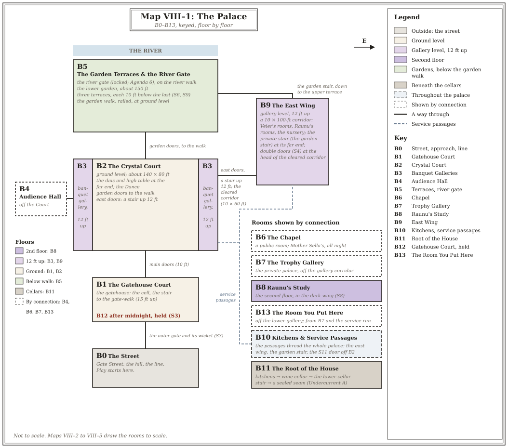
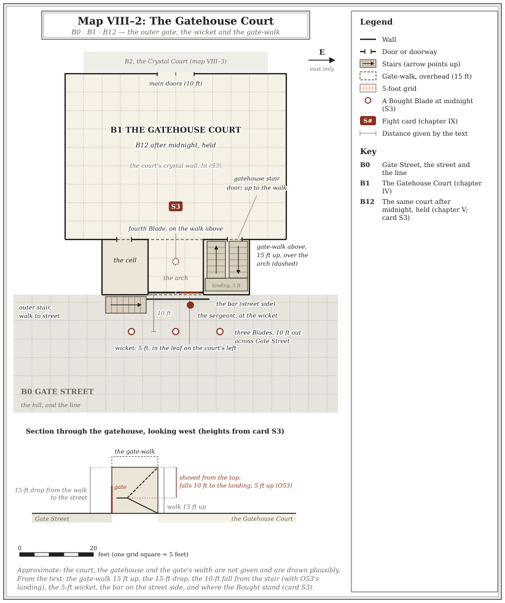
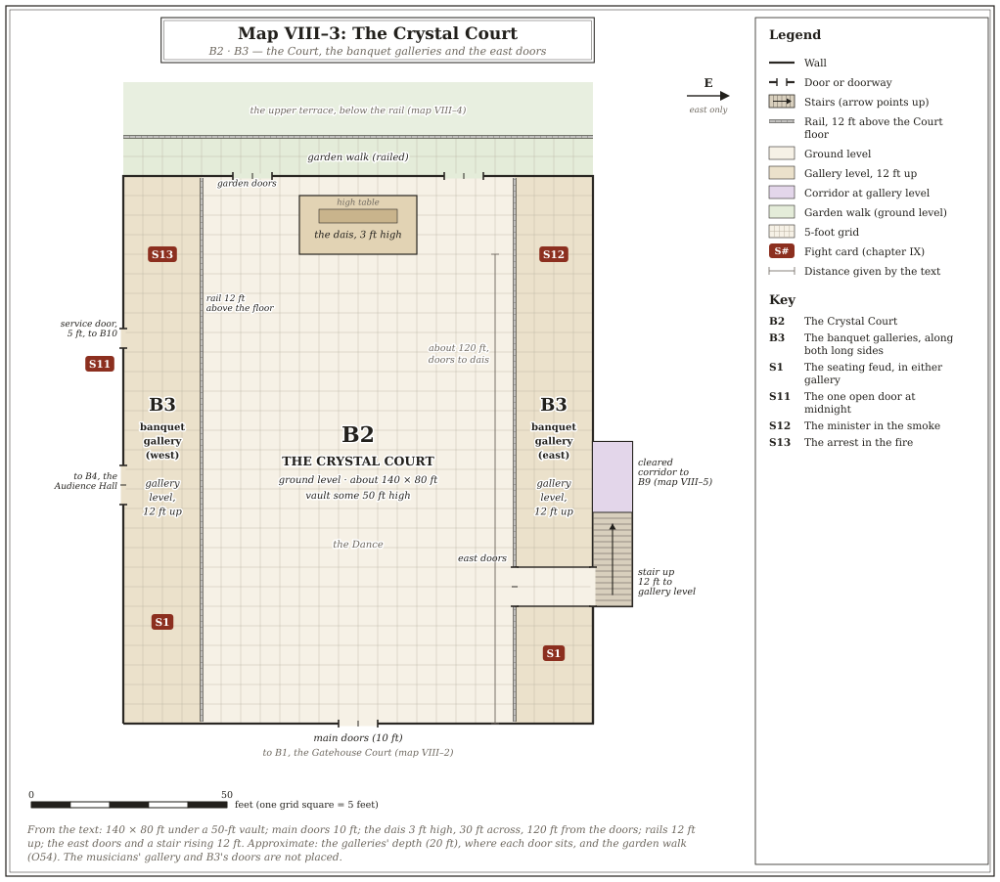
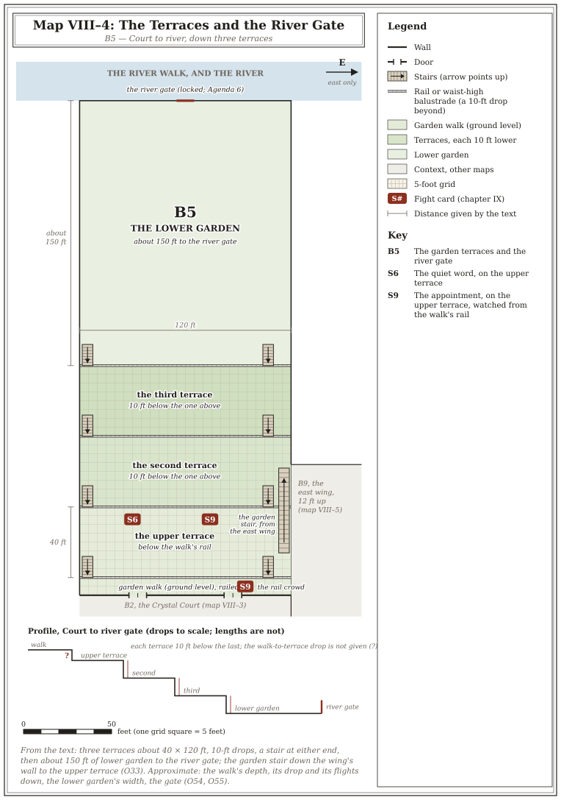
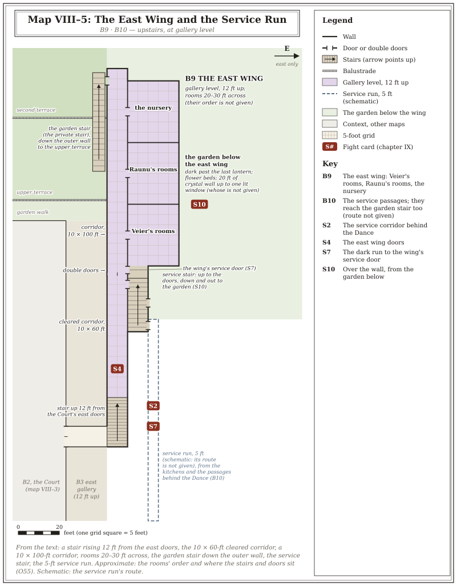

# VIII. The DM Sheet, the Palace and the Handouts

*The first two pages are yours: the whole night on two sheets. The third is the palace.
After those come the Snake Tracker, Where Everyone Stands, and the rumor table, then
the handouts for the table. Print the first three pages and run the night from them.*

---

## The DM Sheet — the Night on Two Pages *(the night-tracker)*

### Page One: The Night and Midnight

**Table VIII–1: The Night** *(four players; minutes from Table I–1)*

| Start | Movement | Scheduled | The omen | The quiet guest | Fights to show (chapter IX) |
|---|---|---|---|---|---|
| 0:00 | **The street** (10) | Pick character, agenda, hook (chapter I); read B0; *"what does your mask look like?"* | — | — | — |
| 0:10 | **I. Receiving Line** (25) | Corval receives by name, from memory; nobody is disarmed; the hosts are absent | Nine honor guards, facing inward | Holds a cup out for nobody | S4 if anyone draws |
| 0:35 | **II. Empty Rooms** (45) | Vorlain holds court; the factions circulate; still no host | Corro's gift rings, pointing nowhere | Stares at a crystal wall for a full minute | S1 · S6 |
| 1:20 | **III. Summons** (35) | A glimpse on the high gallery; Corval fetches guests to B4 (≥1 player character; two together once) | Three gray masks Corval cannot account for | — | S6 · Tavva's scout · S1 if held from II |
| 1:55 | **IV. Toast** (25) | Raunu at the high table: *"At the Unmasking I will have something to say"*; **two plates**; gone | The mews scream, then silence | Turns to follow the music | S7 begins |
| 2:20 | **V. Hour of Spirits** (40) | Dead Dance; quarter-bells; the S9 appointment at the first; Vell to the river gate; east wing doubled | *"You dance like my daughter would have."* | Watches the party, loses them to a glint | **One per group:** S2 · S7 · S8 · S9 · S10 |
| 3:00 | *Break* (10) | As the bells ring midnight | | | |
| 3:10 | **VI. Unmasking** (50) | Lights die **mid-sentence**; the attack; the dais; the Crossing; the leash takes the three once the boat is clear | — | Sets down the cloak and cup; stands by the three | S11 · **S14** if they interfere · S8 · S5 |
| 4:00 | **VII. Longest Night** (40) | Fire, rescue, the gate; **then** the last bell (at the latest, S3's bell clock); word of other attacks with the sect guard | — | — | **S3** · S12 · S13 · S5 · S14 |
| 4:40 | **Epilogue** (10) | Chapter V read-aloud; *what do you carry out?*; **5th level** | | | |

**Checkpoints:** the toast by **2:15**; midnight by **3:15**. If you are behind, cut B13,
spare Undercurrents, a second card per Movement, S1, and the east wing only if nobody
carries Agenda 4. Never the gate.

**Table VIII–2: Midnight — Who Goes Where**

| Who | At the lights | Then |
|---|---|---|
| **The Wept** | The dais (B2), for Raunu | Through the wards to him. Delay buys him rounds |
| **The Radiant** | B9, for Veier | Private stair → garden → **the Crossing** (B5), Movement VI. Vell holds him there once |
| **The Hollow** | The main doors (B2) | Herds the crowd back in. His Fracture opens the doors |
| **The Attendant** | Beside the three | Idle until the party gets in the way; then Focused whenever one of the three has no Delay → **S14** |
| **Raunu** | The dais | Spends his last charge sealing doors behind Veier; dies there, by his own choice |
| **Veier** | B9 | Wounded once; down the private stair on Vell's arm; out the river gate (**by default, even if no player character is there**) |
| **Vell** | — | Service passages → garden stair → the river gate (B5) |
| **The nine honor guards** | Seven to the dais, and stay; two hold the east-wing doors (Table VIII–7) | — |
| **The Bought** | The outer gate shut from outside (B12) | Hold it until the gate is decided (S3) |
| **Corro** | Moving three seconds before the dark | Follow him and live. S11 if Phern heat is 3–4 |
| **Maiven** | Toward the east wing, whatever her heat | Dies there unless somebody competent goes with her |
| **Vorlain** | B3 | Hauls guests out of the burning banquet gallery. S13 if Draunel heat is 3–4 |
| **Anha** | The service passages | The other way out, if anyone befriended her |
| **The snakes** | Heat 0–2: get their principal out | Heat 3–4: their card is live (Snake Tracker, below) |

*The order of the night after the lights is printed once, in chapter V (see chapter V,
"The Midnight Clock").*

**The pillars.** Raunu falls, by his own choice · Veier and Vell go out through the
river gate · the Uninvited leave no trace · no one is ever charged · **the heir stays
secret**: no faction learns of the child unless a player character tells them.

### Page Two: Rules, DCs and Costs

**Midnight rules, one line each** *(chapter V has them in full)*

- **Down, Not Out** (see chapter V, "Down, Not Out"). Nobody an Uninvited or the
  Attendant drops dies tonight, unless it is an Uninvited's quarry: a companion or the
  crowd gets them up. Whoever lands the last blow on an Uninvited may be thrown when it
  returns.
- **Buying Time.** A Delay die per Uninvited, on the table. Each point = one turn of
  movement lost. A clever trick with the room, the crowd, a door, a lie: the skill that
  fits, DC 13 → 1 Delay (DC 15 the second time; never a third). A Fracture → 2 Delay.
  30+ damage to one in a round → 1 Delay. The Attendant's *Clears the Way*: −1 Delay a
  round.
- **The Attendant (S14).** *Idle:* rusty, one attack with Disadvantage. *Focused* (at
  the start of its turn, if one of the three in the scene has no Delay): two turns a
  round, and *Put Aside*. **Distract** (action; **one try a round**, no Help): an
  ability check using the skill that fits, DC 13 Idle / 19 Focused; +2 for playing it
  out, +2 for a habit the party has seen (max +4); a repeat has Disadvantage and no
  bonus, never a third time. A success while Focused **breaks its focus** until its next
  turn (succeed by 5 or more: it loses that turn too). A success while Idle makes the
  distractor furniture to it for the scene, and doesn't count. Arguing its orders is one
  more trick. **Fourth broken focus:** it
  wanders off. 0 HP: gone into the shadow. Say its state aloud: *"It's locked on you" /
  "It's drifting."*
- **Fractures.** Needs one witnessed tell. Action within 30 ft.: an ability check using
  the skill the words fit, DC 18 with one tell, 15 with two or more (the Wept: 15 once
  she has 2+ Delay). A miss by 4 or less still lands and gives 2 Delay, after one blow
  or word. Never Intimidation or Deception. Once each.
- **Wards.** Steer: action, a DC 13 Intelligence (Arcana) check for anyone who studied
  them, a DC 18 Intelligence (Arcana) check otherwise; each ward-point once tonight;
  against an Uninvited, 1 round = 1 Delay. From the Root (B11): palace-wide with a DC 13
  Intelligence (Arcana) check, shelter for a dozen, and the Uninvited will not enter.
- **Crystal charges** within 30 ft. of an Uninvited: a DC 13 Charisma check to release,
  or it goes dark and is spent.
- **Two hundred people.** One guest per 5-ft. square of crowd (AC 10, 4 HP); a
  damaging area spell hits one guest per square it covers. The crowd is Difficult
  Terrain. Each retinue the party talks round at the gate (a DC 13 Charisma (Persuasion) check) takes one
  Blade off them (see chapter V, "Two Hundred People").
- **The gate (S3).** Through the wicket: a DC 15 Strength (Athletics) check to force the
  bar, a DC 13 Dexterity check with Thieves' Tools, a key from a fallen Bought, or a climb
  to the gate-walk (a DC 13 Strength (Athletics) check); the sergeant parleys at the grille. The Blades quit when the sergeant
  falls **or** half are down. The fire clock ticks only on rounds nobody fights or
  talks. Void the contract (with proof, a DC 13 Charisma (Persuasion) check to the sergeant;
  the captain needs no check), buy them out, or outlast them. **The last bell rings after the gate is
  decided**, or at the end of Movement VII if no character reached it (ending 3, offstage).

**Table VIII–3: Key DCs**

| Check | DC |
|---|---|
| The line's first check (B0) | 13 Charisma (Persuasion) or Wisdom (Insight) |
| An approach across station, behind a mask | 10, the check that fits the approach |
| Identify a masked guest you know / have only heard described | 15 / 20 Wisdom (Insight) or Wisdom (Perception) |
| A borrowed invitation at the gate / one with the wrong name on it | 13 / 18 Charisma (Deception) |
| Slip past a posted guard · a hire's livery and a confident walk · an honest story | 15 Dexterity (Stealth) · 10 Charisma (Deception) · 13 Charisma (Persuasion) |
| A locked door in the private palace · the study's crystal lock | 15 / 18 Dexterity (Thieves' Tools) |
| The service passages without a guide (first time only) | 15 Wisdom (Survival) |
| Deceive Corval about the household · bribe him | 20 Charisma (Deception) · impossible |
| Deceive Raunu · move Vell | 25 Charisma (Deception) · 25 Charisma (Deception, Intimidation, or Persuasion) |

**Table VIII–4: Costs to Hand** *(a near miss: name the cost first, and the thing still
arrives)*

| d6 | The cost |
|---|---|
| 1 | Somebody saw — and will remember the mask, if not the face |
| 2 | Corval will remember you asked |
| 3 | It takes longer than it should; the Movement moves on without you |
| 4 | You owe somebody for it, and they say so |
| 5 | A snake notices your interest, and its tell turns your way |
| 6 | You get it, and something you were carrying — a charge, a secret, a favor — is spent |

---

## The Palace, Keyed

*Five maps, drawn from chapter V ("The Palace After Midnight: General Features"). Map
VIII–1 is a schematic drawn without a scale: every room, the ways between them the text gives, and
the floor each is on. Maps VIII–2 to VIII–5 are drawn to scale on a 5-foot grid, at the
sizes chapter V prints: the Crystal Court about 140 by 80 feet, three 40-foot garden
terraces and 150 feet of lower garden, and an east wing corridor about 100 feet long. The
east wing is upstairs: the Court's east doors open on a stair that rises 12 feet to gallery
level, and the wing's private stair is the garden stair, running down its outer wall to the
upper terrace. Whatever the text does not fix (a wall's exact line, which way a stair turns,
the order of the wing's rooms) is drawn plausibly, and each map's caption says so. Dashed
lines are the service passages, which thread the whole palace; where the text gives no
route for them, the map marks them schematic. Each map links a PNG copy for printing.*

**Map VIII–1: The Palace** *(schematic, keyed B0–B13, floor by floor)*

*[PNG](maps/map_viii_1_palace.png). The street (B0) up through the Gatehouse Court (B1, held
after midnight as B12) to the Crystal Court (B2), with the banquet galleries (B3) along both
sides and the Audience Hall (B4) off it; the gardens (B5) beyond the garden doors; the east
wing (B9) up the east-door stair. The rooms the text places only by connection (B6, B7, B8,
B10, B11, B13) are boxed at the right with those connections.*

**Map VIII–2: The Gatehouse Court** *(B0, B1, B12; card S3)*

*[PNG](maps/map_viii_2_gatehouse.png). The outer gate with its bar on the street side and
the wicket in its left leaf; the cell and the gatehouse stair, which climbs to a landing
and then to the gate-walk 15 feet up; the outer stair down to Gate Street; where the Bought
stand at midnight. The section below the plan gives the heights.*

**Map VIII–3: The Crystal Court** *(B2, B3; cards S1, S11, S12, S13)*

*[PNG](maps/map_viii_3_court.png). The floor, the dais at the far end, the main doors, the
garden doors to the railed garden walk, the galleries and their 12-foot rails, the east doors
and the stair up, the service door on the gallery side (S11).*

**Map VIII–4: The Terraces and the River Gate** *(B5; cards S6, S9)*

*[PNG](maps/map_viii_4_terraces.png). The garden walk and its rail, the three terraces and
their balustrades and end stairs, the foot of the garden stair, the lower garden and the river
gate. A profile gives the drops.*

**Map VIII–5: The East Wing and the Service Run** *(B9, B10; cards S2, S4, S7, S10)*

*[PNG](maps/map_viii_5_east_wing.png). The stair from the east doors, the cleared corridor and
the double doors, the wing's corridor and its three finds, the garden stair, the service stair
beside the doors with the wing's service door, the service run (schematic), and the garden
below the wing.*

**Rooms the text does not place:**

- **B6. The Chapel.** A public room; Mother Sella's, all night.
- **B7. The Trophy Gallery.** The private palace, off the gallery corridor.
- **B8. Raunu's Study.** The second floor, in the dark wing.
- **B10. Kitchens & Service Passages.** The passages reach every part of the palace,
  the east wing and the garden stair included. The one open door off B2 at midnight
  (S11) leads into them.
- **B11. The Root of the House.** Kitchens → wine cellar → the lower cellar stair →
  a sealed seam in the far wall (Undercurrent A).
- **B13. The Room You Put Here.** Off the lower gallery; reachable from B7 and from
  the service run.

---

## The Snake Tracker

*Heat 0–4 per faction (chapter IX, Table IX–2, is the full rule). Tick a box when a line
goes unanswered; clear one when the party steps on it. Read every row at the first
scream: **0–2**, they get their principal out; **3**, the midnight card is live;
**4**, it starts with steel already out (each card's *At heat 4* line says how). A line the table was never shown does not
heat up. The Thenya are here because they can become a fight, not because they are a
snake.*

**Table VIII–5: The Snake Tracker**

| Faction | Heat | Starts | Rises (+1) — ✱ automatic | Falls | At heat 3–4 |
|---|---|---|---|---|---|
| **The Circle** | ☐☐☐☐ | 1 | ✱ the toast · Callun's coin refused (Mv III) · **to 4:** S7's clock filled, or the nursery sold to her | −1 per knife turned or caught quietly · **to 0:** Agenda 1 delivered, the Tithe told to Callun, or Callun told what her knife did to an under-cook | **S12** |
| **The Church** | ☐☐☐☐ | 1 | ✱ the Radiant's blessing · a warden refused or humiliated before guests · S8's tell shown and not stepped on by midnight | −1 if Kovaun is given something true to file about the gray masks · −1 if the wardens are turned back at the study door (S8) · **to 0:** Agenda 2 delivered | **S8**, in the dark |
| **House Draunel** | ☐☐☐☐ | 1 | ✱ the toast · Agenda 3, if one of the characters carries it, refused or failed · Iron 2 stopped without Draunel losing face · S9's clock filled (on the terrace or offstage) | −1 if Draunel is embarrassed before guests · **to 0:** Agenda 3 delivered | **S13** |
| **House Boranis** | ☐☐☐☐ | 0 | ✱ the appointment accepted (Mv IV) · Vorlain baited, or drunk, by one of the characters · Draunel's heat reaches 3 · a cousin beaten in public (S6) · S9's clock filled (on the terrace or offstage) | −1 each time the party helps Essin keep Vorlain sober · −1 if S6 ends quietly · −1 if S9 ends with nobody drawing · **to 0:** Essin warned of the appointment before Mv IV | **S13**, if Draunel is also 3–4 |
| **Phern** | ☐☐☐☐ | 0 | ✱ once each in Mv II, III and IV (the omens) | −1 if a player character walked the room with Corro · −1 if Corro trusts one enough to take an instruction at midnight | **S11** |
| **The Thenya** | ☐☐☐☐ | 1 | ✱ the toast · ✱ the audience refused · a player character lies to Maiven, or refuses her and says so | −1 if a player character promises to go with her and means it · **to 0:** proof of Veier | **S10** in Mv V *(at midnight she goes east whatever her heat)* |

**If the table does nothing,** midnight arrives with the Circle at 2, the Church at 2,
Draunel at 2, Boranis at 1, Phern at 3 and the Thenya at 3. The Thenya spend theirs at
the half-bell in Movement V (S10). So the only card live in the dark by default is
**S11**, plus the gate, the looters and the Attendant if the party interferes.

## Where Everyone Stands (Movements I–V)

**Table VIII–6: Where Everyone Stands**

| Who | I | II | III | IV | V |
|---|---|---|---|---|---|
| Raunu | *(unseen — B8/B9)* | *(unseen)* | high gallery glimpse, then B4 | the high table — the toast, two plates, gone to B9 | B9 with Veier; to the dais at the bells |
| Veier | B9 | B9 | B9 (Agenda 4 / Und. C only) | B9 — dinner for two | B9, guard doubled |
| Vorlain | B2 | B3 wine court | B3, watching the audiences | B2 — watch his face | B3, drinking harder |
| Essin | with Vorlain | with Vorlain | with Vorlain | with Vorlain, not smiling | B5 edge, alone — the S9 appointment |
| Corval | B1 gate | everywhere | B1/B2, fetching guests | B2 | doubles the east-wing guard |
| Kovaun | B1 line | B2, census | B4 antechamber | B2 | B6 chapel, briefly |
| Sella | B6 | B6 | B6 | B2 for the toast | B6 — the masks rite |
| Callun | B1 line | B3 alcove with Corro | B3 | B2 — recalculating | B3 |
| Corro | B2 | B3 alcove — uneasy | B2 — worse | B2 — bad | B2, back to a wall |
| Draunel | B2 | B3 | B4 line, courting | B2 | B3 |
| Maiven | B1 — impatient | B3, pressing Corval | B3, petitioning | B3 — audience refused | B9 doors — one bad hour from the wall |
| Anha | B10 | B10 | B10 | B10, at the service door | B10 |
| Vell | B1, unmemorable | B5 gardens, once | B2 edge | B2 edge | B5 — the river gate |
| Tavva | B1, hired livery | B10, learning the halls | her scout walks the B7 corridor | B3, unremarkable | dark corridors — staging |
| The Uninvited | — | — | B2 edge, arriving | B2 edge, still | Wept: east doors · Radiant: the Dance · Hollow: the exits |
| The Attendant | B0/B1, in the line | B2, at a crystal wall | B4 line | B2, following the music | B2, edge of the Dance, watching the party |

**Table VIII–7: The Honor Guard, Post by Post** *(the nine; "once the line is in" means
from the moment the last guest is through the gate)*

| Post | I | II–IV | V | Midnight |
|---|---|---|---|---|
| The gate (B1) | All nine, facing inward, while the line comes in | — | — | — |
| The east-wing doors (B9) | Two, once the line is in | Two | Four (Corval doubles them) | Two, who stay |
| The trophy gallery (B7) | Three, once the line is in | Three | Three | — |
| With the household | Four, once the line is in | Four | Two | — |
| The dais (B2) | — | — | — | Seven, who die or fall there |

*The alert guards (see chapter IV, "The Palace on Alert") come from the nearest post. S4's
two are the two nearest; at the east-wing doors before Movement V, they are the two on the
doors.*

---

## Rumors at the Ball *(DM table)*

*Roll 2d6 in any social scene, or choose. The 2d6 is deliberate: the common rumor
comes up most. Every rumor is delivered with total confidence. None is confirmed.
Several cannot all be true, which bothers nobody telling them.*

**Table VIII–8: Rumors at the Ball**

| 2d6 | What they're saying behind the masks |
|---|---|
| 2 | He never left. The man who "returned" is the man who never went anywhere — test him on the old days and watch his eyes. |
| 3 | He walked into the eastern mists and the mists gave him back. That's why they've fallen — they're *empty* now. He brought back what was in them. |
| 4 | The Church took him for a year of questioning and returned him hollowed. Why else would the Prelate herself attend a house the Church despises? |
| 5 | He went beneath the palace, where the first Boranis crystal was grown, and slept a year in the root of the house. The walls feed him now. That's why the staff was cut — fewer eyes. |
| 6 | The Thenya bride is already dead, and tonight's "announcement" will be a changeling got on some serving girl. The Thenya delegation knows — watch how they don't drink. *(Untrue. Veier is alive; see chapter VII.)* |
| 7 | *(The common one.)* The marriage is coin, plain and simple: the Thenya paid their last treasure for their border, and the recluse wanted an heir nobody could refuse. Everything else is theater. |
| 8 | Vorlain has never stopped ruling. Raunu is a mask his brother wears when the seat needs a beloved face. Two chiefs, one house — count who the ministers *actually* bow to. *(Untrue. Vorlain gave the seat back and has no plot; see chapter VII.)* |
| 9 | A Kshalo (one of the eastern river country's people of dreams and the herb-lore of sleep) dreamed him away, and he bargained his way back with something he'll spend the rest of his life paying. The offerings in Elanna's niche? That's the interest. |
| 10 | He crossed the mountains and saw Mazaa — walked among the godless machines — and came home to make the Orthaen ready for what's coming west. The new decrees are war logistics wearing worker's clothes. |
| 11 | The staff weren't dismissed. They're still *in* there. Ask yourself why the east wing needs guards on the inside of the doors. *(Untrue. The staff were paid off and relocated; see chapter IV, "Undercurrent B — The Household That Wasn't".)* |
| 12 | He found something in his year away that told him the day he'll die. Everything since — the pact, the bride, the silence, this ball — is a man setting his affairs in order. *(Deliver this one straight. Let the table sit with it at dawn.)* |

---

## Player Handouts

*Everything from here to the end of the chapter goes across the table, except the
italic line at the head of each handout, which tells you when to hand it over.*

### Player Handout 1: The Invitation

*Put it on the table in the first five minutes (chapter I). In the fiction it is the
card a character with **The Invited** hook carries to the gate (chapter IV, area B1). A
character with **The Discarded Invitation** hook carries one with someone else's name on
it.*

*Reproduce on good paper if you can. The text is canonical:*

> **HOUSE BORANIS**
>
> *To My Esteemed Guest,*
>
> It is my great honor to invite you to the seat of our people, the Palace Boranis,
> for a night of revelry in the bounty bestowed upon our lands on the last night of
> Oraga. I look forward to seeing you all and sharing food, drink, and revelry with
> you among the spirits as we look forward to a bright future.
>
> *Given Under My Hand,*
> **Raunu Boranis**

---

### Player Handout 2: Agenda Cards

*Deal these in the first five minutes (chapter I), cut apart, one card to each player.
The full agendas and their private "At midnight" notes are in chapter II ("The Eight
Agendas"); these cards carry only what the character knows.*

**1. THE CIRCLE'S RECKONING** — *They call it "the Tithe of Hands." Learn what the
chief's new decree does before it is proclaimed. The Circle pays for foresight.*
*Nothing is written down; the decree lives in Minister Corval's head and two others'.
Corval cannot be bought.* **Pays:** 100 GP in Circle silver, on delivery.

**2. THE PRELATE'S QUESTION** — *One question, answered honestly, and the Church
owes you a favor you may spend anywhere: is the man who came back the man who
left?*
*He will be seen perhaps four times tonight. The Prelate will know if you shade the
answer.* **Pays:** one favor from the Church, of frightening size.

**3. A HOUSE'S LONG GAME** — *Vorlain ruled for a year and handed it back. Find
out if he misses the taste. Get him to say anything we could later call an
understanding.*
*Vorlain is careful when he is sober.* **Pays:** Lord Draunel's gratitude.

**4. THE COUSIN'S ERRAND** — *These words, learned by heart, and her grandmother's
ring, into Veier's own hands — no minister, no husband, no exceptions. Bring back
her answer, word for word. Bring back the truth of how she fares.*
*Nobody has seen Veier in public for two years. The east wing is closed and guarded.*
**Pays:** Maiven Nolonaire's trust.

**5. THE UNPAID DEBT** — *Grandmother's soul-crystal hangs in their trophy gallery
like a hunting prize. It took her sixty years to grow. Take it home.*
*The gallery is warded, and the house's few guards watch it closely.* **Pays:** the
crystal, home.

**6. THE GATE AT MIDNIGHT** — *Triple rates, in old coin, for one small thing: the
river gate at the bottom of the garden, unlocked at midnight. Not before. No
questions.*
*You do not know who paid you.* **Pays:** 30 GP in old coin, already in your purse.

**7. THE STORY OF A LIFETIME** — *The mists fall, the silent house opens, the
vanished chief throws a ball. Every thread knots in that palace tonight. Witness
truly. Get the testimony out alive.*
*True testimony makes its carrier dangerous to everyone.* **Pays:** nothing but the
testimony.

**8. THE VANISHED SERVANT** — *Anha's word home stopped coming with the festival
carters when the staff was cut, two years ago. She was not among the dismissed.
Tonight the doors are open. Find her.*
*The skeleton staff are paid triple and forbidden to send word home.* **Pays:** your
sister.

---

### Player Handout 3: Crystal Charges

*Give this page to every player whose character carries a crystal charge.*

Orthaen crystal holds finished workings, and a **charge** is one of them: a
consumable magic item, one stored working, released at a touch by anyone, gifted or
not, trained or not. Releasing one does not make its bearer a caster.

- **Releasing a charge** takes the Magic action (an action, at a 2014 table), and no
  check. The charge is spent. Charges need no attunement.
- **The six every Orthaen knows** are *common*: minor, local, brief. A gifted Orthaen
  with the Orthaen Gift can grow one in a day of downtime from 25 GP of raw crystal,
  one at a time, and no more than one a week: a gift is not a mint (see chapter III).
  Price: 50 GP, which is a season's wages in the wrong district.
- **Chancy releases.** When the fiction makes a release uncertain (fumbled in the
  dark, jostled in a crowd), the bearer makes a DC 13 Charisma check; on a failure,
  the action is spent and the charge is not.
- Some things at this ball smother a charge; the DM will tell you.

**Table VIII–9: Crystal Charges**

| Charge | Rarity | When released |
|---|---|---|
| *Steady Light* | Common | The crystal sheds Bright Light in a 20-foot radius and Dim Light for a further 20 feet for 1 hour. |
| *A Sealed Door* | Common | One door, lid or window you touch, no more than 10 feet across, grows shut for 1 hour. Forcing it is a DC 15 Strength (Athletics) check; your touch opens it. |
| *A Veil of Quiet* | Common | For 10 minutes, no sound made within 10 feet of the crystal can be heard beyond that distance. Sound from outside still comes in. |
| *A Chime at a Threshold* | Common | Set on a doorway or gap up to 20 feet wide. For 8 hours, when a Tiny or larger creature crosses it, the crystal chimes, audibly, within 60 feet. |
| *Warmth* | Common | For 8 hours the bearer is comfortable in cold down to a hard frost, and has Advantage on saving throws against extreme cold. |
| *A Held Image* | Common | The crystal shows the still, silent image its grower set in it — up to a 5-foot cube — for 1 minute. |
